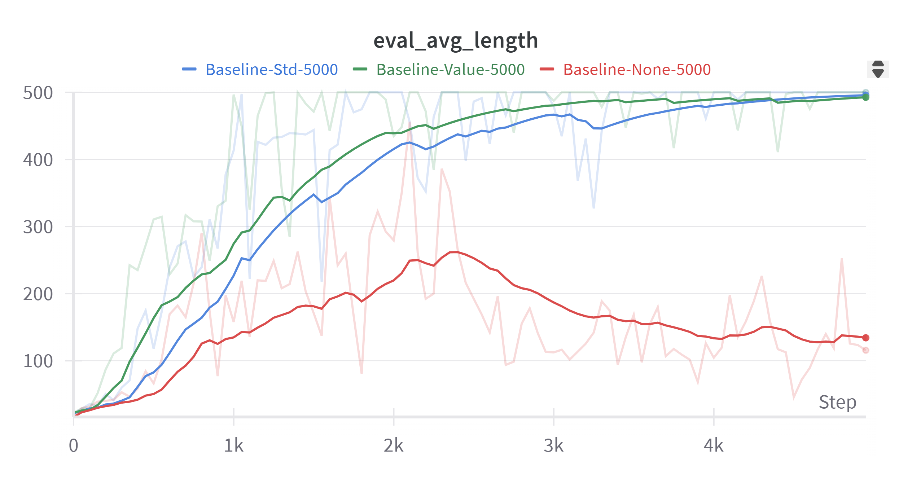
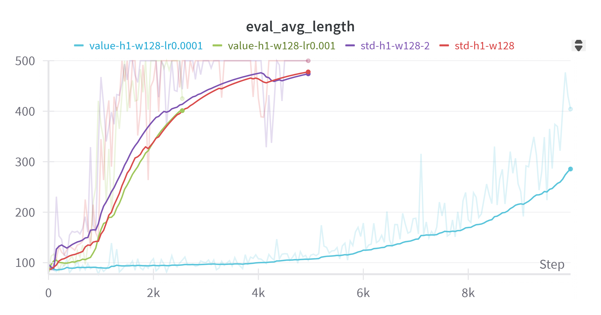
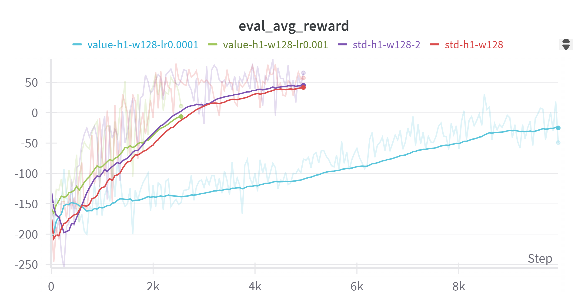
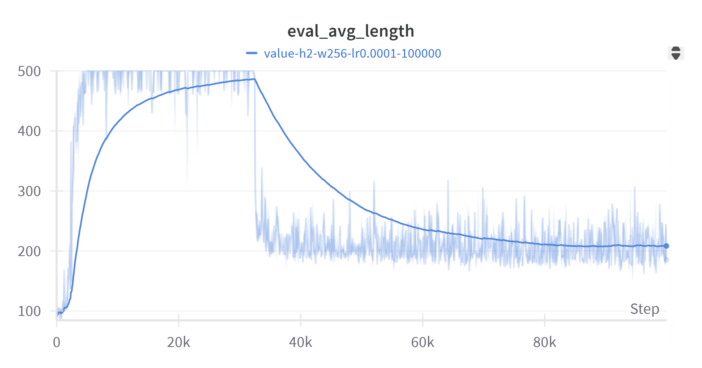
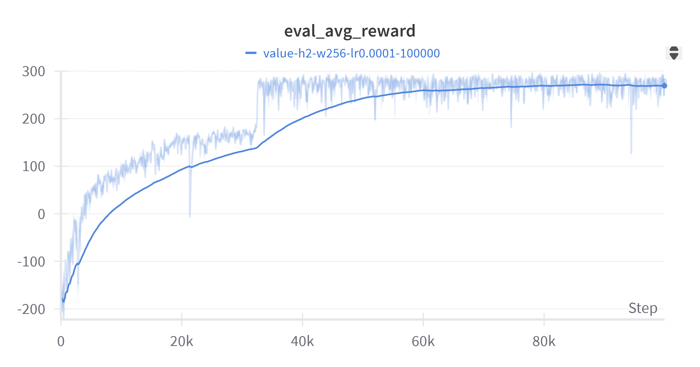
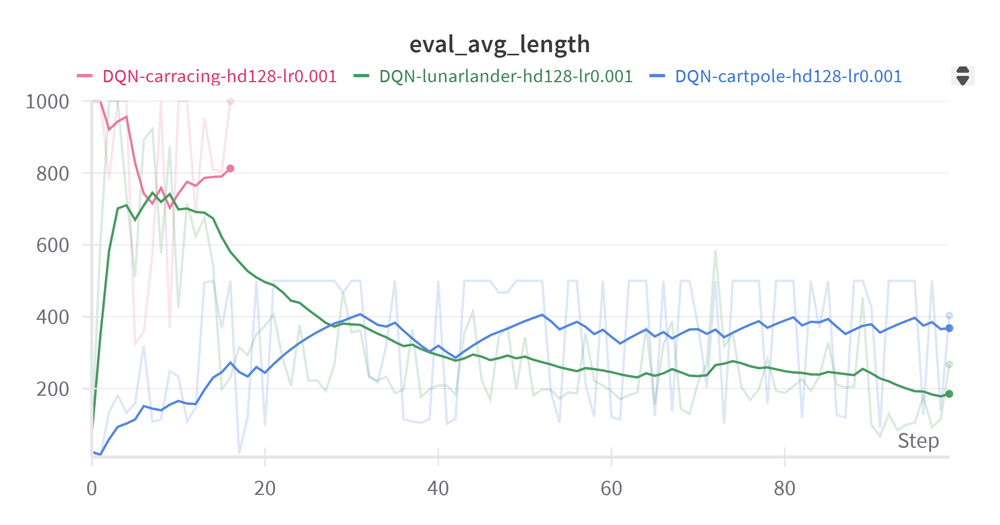
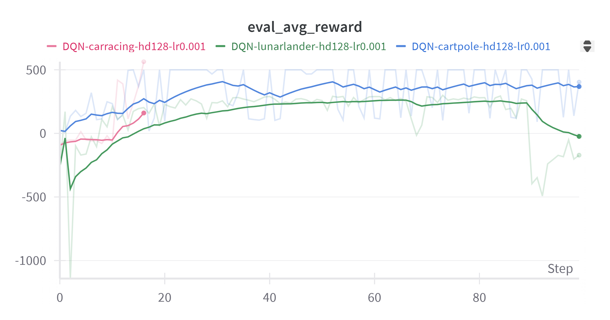
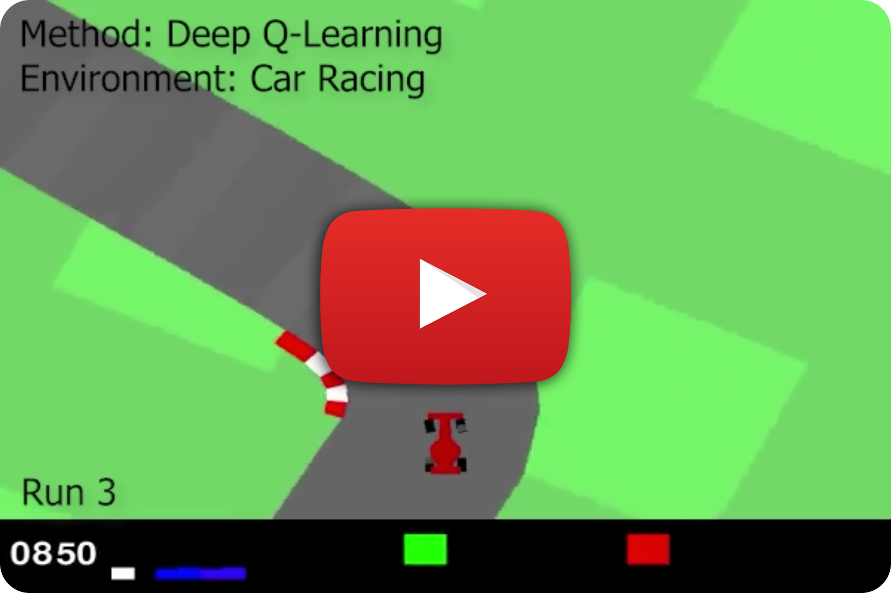

# David Megli - Deep Learning Applications Lab 2

This project is an implementation of Lab 2 for the Deep Learning Applications course in the Master's Degree in Artificial Intelligence at the University of Florence.

Here are the requirements, the exercises descriptions and results, and the instructions to train and test the trained models.

## Requirements

- Python 3.6+
- PyTorch
- Gymnasium
- WandB (Weights and Biases)

## Installation

Clone the repository and install the requirements:

```bash
git clone https://github.com/davidmegli/msc-ai-deep-learning-applications-lab2.git
cd msc-ai-deep-learning-applications-lab2
conda create --name lab2 --file requirements.txt
conda activate lab2
```

# Exercises

## Exercise 1 - Reinforce Algorithm
My version of the reinforce algorithm can be found in ```reinforce-cartpole/reinforce.py```. I used as a baseline the professor's Reinforce function.
## Exercise 2 - Reinforce with Value baseline
#### Description
The standardized baseline was already implemented in ```reinforce-cartpole/reinforce.py```. 
I implemented the **ValueNet** in ```reinforce-cartpole/networks.py```, which is a deep neural network with the same structure as the PolicyNet, but is used to estimate the value function, which can be used as a baseline in the Reinforce algorithm.
#### Results
From the next plot we can appreciate the quantitative comparison between the different baselines evaluated on the Cartpole environment. The reported metric is the average episode length evaluated every N training episodes on M episodes.
- We can see that **without any baseline** the network is not even able to learn to keep the pole erect after 5000 episodes, insted we see that after about 2000 episodes the average episode length even gets worse!
- The **std baseline**, which consists of subtracting the average return and dividing by the variance of the returns, significantly improves the performance, enabling the network to learn to keep the pole erect.
- The **Value baseline**, which uses the Value Network to estimate the value function to use it as a baseline, improves even more the performance, making the network converge faster to the maximum episode length and increasing stability during training.

## Exercise 3
### Exercise 3.1 - Solving Lunar Lander with Reinforce
In this exercises I solved the `Lunar Lander` Environment using the **Reinforce** algorithm, the PolicyNet and the ValueNet implemented in the previous exercise.

- In my first attempts I tried to train the network for 5000 or 10000 episodes, but the network didn't seem to learn how to make the spaceship land. Indeed it seemed like the network just learned to keep the spaseship flying, to not receive the big negative reward to crash on the ground, and the learning curve had a plateau, as you can see from the following 2 plots, reporting the average evaluated length and reward.
The plateau in the average length, which increases instead of decreasing, shows indeed that the network learns to keep the spaceship flying as long as possible, using as less as possible fuel. Also, the episode is considered solved if the score is higher than 200, and the reward for landing on the objective is 100, but in the second plot we can see that the reward doesn't even reach 50, while with lower learning rate it remains negative.


These are just a few examples of the attempts I made, with different settings. As you can see I also tried to lower the learning rate, hoping that instead of just learning to keep the spaseship flying, the network would have had more time to explore different actions and discovered the big reward it would get for landing on the objective without crashing.

- After these failed attempts, I thought about letting the network run for many more episodes, hoping that it would sooner or later land on the objective (I also tried to lower the learning rate).
And that's actually what happened!
As you can see from the following 2 plots, after about 32000 episodes there is a drop of the episode length and an upward spike in the reward.
This probably means that around the **episode 32000**, in this particular case, the **spaceship landed for the first time**, and the network started to learn how to get an higher reward.
Indeed from this point the average episode length drops from 500 to around 200, and the reward converges to 270, surpassing 200, considered as solved, from around episode 39950, so after about 7000 episodes from the (supposed) first landing.


Note: I probably could have used a higher learning rate, and just let the network train for enough episodes.

### Exercise 3.2 – Solving CartPole and LunarLander with Deep Q-Learning

In this exercise, I implemented the **DQN algorithm** from scratch to solve `CartPole` and `LunarLander`.

- I started by building a **QNetwork**, a simple multilayer perceptron that takes the environment's state as input and outputs Q-values for all possible actions.
- To stabilize training, I used a **Replay Buffer** to store transitions and sample random minibatches. This avoids learning from consecutive, highly correlated experiences.
- I also implemented a **target Q-network**, which is a separate copy of the Q-network that's updated periodically. This helps prevent instability by making the Q-learning targets less noisy.
- I implemented the DQN **training loop** as follows:
  - For each episode, actions are selected using an epsilon-greedy strategy. (To balance Exploration vs Exploitation. I also introduced an epsilon decay parameter to gradually decrease the exploration)
  - Transitions are stored in the Raplay Buffer.
  - After enough steps, batches are sampled to update the network.
- Evaluation is performed every N episodes, and I log the average return and current epsilon value.
- The network checkpoints are saved, and a separate script allows visualizing the agent using a saved model.

The **results** are shown in the exercise 3.3.

### Exercise 3.3 – Solving the OpenAI CarRacing Environment

For CarRacing, the main challenge was dealing with raw pixel observations.
To simplify the training I first created a **`FrameProcessor`** to convert RGB frames to grayscale and resize them to 84×84 pixels, which is a standard input suze used in many Deep RL applications. 
Since a single frame doesn't contain motion information, to  allow the agent to infer motion and direction, I implemented a **`FrameStacker`**. This stacks the last **3 grayscale frames**, forming a (3, 84, 84) tensor as the input to the network. This gives the network temporal context.
To process these image inputs, I replaced the MLP with a **Convolutional Neural Network (CNN)**.

The CNN-based Q-network (`CNNQNetwork`) receives the stacked frame tensor and outputs Q-values for each discrete action.

The training loop is the same as in 3.2, I just adapted it to handle image input and the CNN architecture.

In the following 2 plots I have reported the training results of exercise 3.2 and 3.3.
Note: the average reward and episode length are evaluated every 50 episodes, that means that each step in the X axis corresponds to 50 episodes.
DQN was trained for 5000 episodes on Cartpole and Lunar Lander, and for 800 episodes on Car Racing.
It took much more time to train on Car Racing (~8 hours on a Nvidia RTX 3070 Laptop) because the CNNQNetwork is trained on full images.
For the Cartpole and Lunar Lander environments the standard QNetwork was used.


We can see how on Cartpole the episode length (and reward) converges to 500 (even if a bit unstable).
In Lunar Lander the episode length raises until ~800, around episode 500 (step 10), then slowly converges to 200. The reward converges to 250, but strangely it plumments at episode 4500.
In the Car Racing environment the training seems pretty unstable, and since the training took many hours I wasn able to train the network for as long as the other environments.
However the results are really good, indeed I tested the best model checkpoint, and it was able to solve the environment in every episode. 
I think you can better appreciate the qualitative results and comparisons in the video below.

## Qualitative Results
Qualitative results can be found in the ```videos``` folder inside the ```reinforce-cartpole``` and ```dqn``` folders.
However these **results** have been reported in this **YouTube video**:
[](https://youtu.be/pdkXgKGKqQI "David Megli - MSc AI Deep Learning Applications Lab 2: Reinforcement Learning, Qualitative Results")
The results shown come from the trained checkpoints available in the repo.

## Reinforce
### Training
Run the main training script in the ```reinforce-cartpole``` folder with the following command:
```bash
python main.py [OPTIONS]
```

#### Options
- `--project`: Name of the WandB project (default: `DLA2025-Cartpole`)
- `--baseline`: Type of baseline to use (options: `none`, `std`, `value`, default: `none`)
- `--gamma`: Discount factor for future rewards (default: `0.99`)
- `--lr`: Learning rate for the optimizer (default: `1e-3`)
- `--episodes`: Number of training episodes (default: `1000`)
- `--eval_every`: Evaluate agent every N episodes (default: `50`)
- `--eval_episodes`: Number of episodes to use in each evaluation (default: `10`)
- `--visualize`: Set flag to visualize the final agent (default: `False`)
- `--env`: Environment to use (options: `cartpole`, `lunarlander`, default: `cartpole`)
#### Example
To train the agent without using a baseline and visualize the final agent, you can run:

```bash
wandb login
python main.py --baseline none --visualize
```
### Test
Run the test in the ```reinforce-cartpole``` folder with the following command:
```bash
python run_episodes.py [OPTIONS]
```
#### Options
- `--n`: Number of episodes (default: `10`)
- `--env`: Environment to use (options: `cartpole`, `lunarlander`, default: `cartpole`)
- `--checkpoint`: Path to the checkpoint
- `--record`: If set, saves episodes to video instead of rendering live
- `--width`: Width of the loaded network (default: `256`)
- `--depth`: Evaluate agent every N episodDepth of the loaded network (default: `2`)
Note: the sizes of the trained networks were 2x256 and 1x128.
#### Examples
```bash
python run_episodes.py --5 --env cartpole --checkpoint model/cartpole-checkpoint-BEST.pt 
```
```bash
python run_episodes.py --5 --env lunarlander --checkpoint model/lunarlander-checkpoint-BEST.pt 
```
## Deep Q-Network

### Training
Run the main training script in the ```dqn``` folder with the following command:
```bash
python main.py [OPTIONS]
```

##### Options
- `--env`: Environment to use (options: `cartpole`, `lunarlander`, `carracing`, default: `cartpole`)
- `--project`: Name of the WandB project (default: `DQN-Project`)
- `--episodes`: Number of training episodes (default: `1000`)
- `--lr`: Learning rate for the optimizer (default: `1e-3`)
- `--gamma`: Discount factor for future rewards (default: `0.99`)
- `--batch_size`: Size of the batch sampled from the replay buffer (default: `50`)
- `--buffer_size`: Maximum capacity of the replay buffer (default: `64`)
- `--hidden_dim`: Hidden dimension of the Q-network (default: `100000`)
- `--eval_every`: Evaluate agent every N episodes (default: `128`)
- `--eps_start`: Initial value of epsilon for epsilon-greedy action selection
- `--eps_end`: Final value of epsilon after decay
- `--eps_decay`: Decay factor for epsilon
- `--target_update_freq`: Frequency of updating the target network
- `--eval_every`: Frequency of evaluation during training
##### Example
To train the agent without using a baseline and visualize the final agent, you can run:

```bash
wandb login
python main.py --env carracing
```

### Test
Run the test in the ```dqn``` folder with the following command:
```bash
python visualize.py [OPTIONS]
```
The script will also print the obtained reward and the episode length.
##### Options
- `--env`: Environment to use (options: `cartpole`, `lunarlander`, `carracing`)
- `--checkpoint`: Path to the checkpoint
- `--hidden_dim`: Size of the hidden layers (Default = `128`)
- `--episodes`: Number of episodes to visualize (Default = `5`)
- `--record_video`: If set, saves episodes to video instead of rendering live

##### Examples
```bash
python visualize.py --env cartpole --checkpoint model/cartpole-checkpoint-BEST.pt  --episodes 5
```
```bash
python visualize.py --env lunarlander --checkpoint model/lunarlander-checkpoint-BEST.pt  --episodes 5
```
```bash
python visualize.py --env carracing --checkpoint model/carracing-checkpoint-BEST.pt  --episodes 5
```